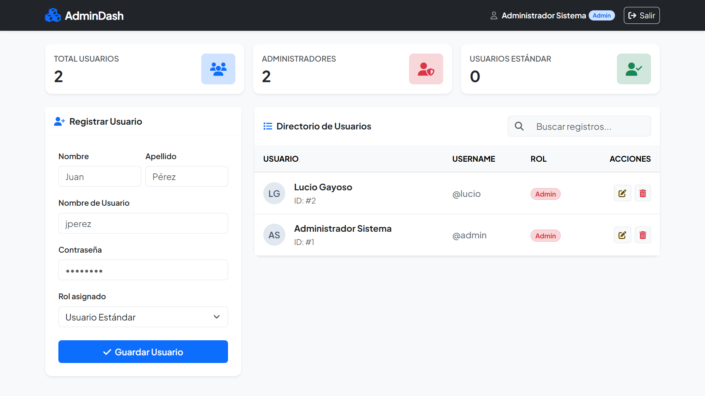

# 🚀 AdminDash - Modern PHP & MySQL User Management System


Un panel de administración moderno, seguro y adaptable para la gestión integral de usuarios y roles. Diseñado con una interfaz intuitiva (UI/UX), métricas en tiempo real, filtrado dinámico y estándares de seguridad avanzados.

---

## 📸 Demo Preview

| Dashboard Principal & Métricas |
| :---: |
|  |
| *Vista general del panel con KPIs, gestión de usuarios y búsqueda dinámica en tiempo real.* |

---

## ✨ Características Principales (Key Features)

* ** Autenticación y Control de Acceso:** Sistema de Login/Logout seguro basado en sesiones nativas de PHP.
* ** Encriptación de Contraseñas:** Algoritmo `Bcrypt` mediante `password_hash()` y `password_verify()`.
* ** Seguridad SQL:** Consultas preparadas con `PDO` para evitar vulnerabilidades de Inyección SQL (SQLi).
* ** Búsqueda Dinámica:** Filtro de registros en tiempo real mediante JavaScript sin recargar la página.
* ** Muestreo de Métricas (KPIs):** Indicadores superiores con el cómputo dinámico de usuarios totales, administradores y roles estándar.
* ** Notificaciones Interactivas:** Integración con **SweetAlert2** para modales de confirmación de borrado y alertas tipo Toast para estados de guardado/edición.
* ** Gestión de Roles (RBAC):** Asignación y control visual de permisos (`Admin` / `Usuario`).
* ** Diseño Responsivo & UI Premium:** Maquetación con **Bootstrap 5**, **FontAwesome 6** y tipografía **Plus Jakarta Sans**.

---

## 🛠️ Stack Tecnológico

| Capa | Tecnología |
| :--- | :--- |
| **Backend** | PHP 8+ (PDO Engine) |
| **Database** | MySQL / MariaDB |
| **Frontend UI** | Bootstrap 5.3, FontAwesome 6, Custom CSS |
| **Interactividad** | Vanilla JavaScript (ES6+), SweetAlert2 |

---

## ⚡ Guía de Instalación Local

### Requisitos Previos
* Servidor local como **XAMPP**, **WAMP** o **Laragon** (PHP 8.0+ y MySQL).

### Pasos de Configuración

1. **Clonar o descargar el repositorio:**
   ```bash
   git clone [https://github.com/tu-usuario/admin-dash-php.git](https://github.com/tu-usuario/admin-dash-php.git)
